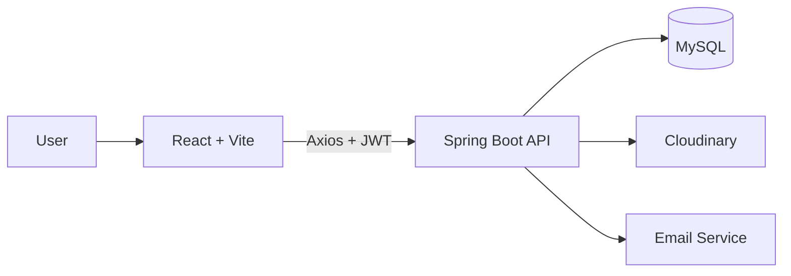

<div align="center">

# 💰 Money Manager System — Frontend

### A fast, modern and responsive finance dashboard

Built with **React**, **Vite** and **Tailwind CSS**


### 🎬 [▶ Watch the Full Demo Video](YOUR_GOOGLE_DRIVE_VIDEO_LINK)

[Backend Repo](https://github.com/momen-tarek111/Money_Manager_Server.git) · [Demo Video](YOUR_GOOGLE_DRIVE_VIDEO_LINK) · [Report a Bug](../../issues)

</div>

---

## 📖 About

**Money Manager System** helps users take control of their finances. Track income and expenses, visualize spending with interactive Recharts dashboards, personalize categories with emojis, and receive transaction reports by email.

This repository contains the **React client**. It communicates with a secured Spring Boot API.

> ⚙️ The REST API lives in a separate repository: **[Money Manager — Backend](https://github.com/momen-tarek111/Money_Manager_Server.git)**

---

## 🎬 Demo

[](YOUR_GOOGLE_DRIVE_VIDEO_LINK)

> 💡 Add screenshots here for a stronger first impression:
>
> ``
> ``
> ``

---

## ✨ Features

| | Feature | Description |
|---|---|---|
| 🔐 | **Register & Login** | JWT-based authentication with protected routes |
| 💵 | **Income & Expense Tracking** | Add, view and delete transactions with form validation |
| 😀 | **Custom Emoji Picker** | Give every category its own emoji icon |
| 🖼️ | **Profile Picture Upload** | Upload and preview avatars (stored on Cloudinary) |
| 📊 | **Interactive Charts** | Analyze income vs. expenses with Recharts |
| 📥 | **Download Transactions** | Export your transaction history as Excel (`.xlsx`) |
| 📧 | **Email Transactions** | Send reports straight to your inbox |
| 🔔 | **Toast Notifications** | Instant feedback with React Hot Toast |
| 📱 | **Fully Responsive** | Clean UI on mobile, tablet and desktop |

---

## 🧰 Tech Stack

| Category | Technology |
|---|---|
| Framework | React.js (Vite) |
| Styling | Tailwind CSS |
| HTTP Client | Axios |
| Icons | Lucide React |
| Notifications | React Hot Toast |
| Emoji | Emoji Picker |
| Charts | Recharts |
| Backend | Spring Boot · MySQL · JWT |

---

## 📁 Project Structure

```
src
├── assets          # Images and static files
├── components      # Reusable UI components
├── pages           # Login, Signup, Dashboard, Income, Expense, Category
├── context         # Global state (auth / user)
├── hooks           # Custom React hooks
├── util            # API config, helpers, constants
└── App.jsx
```

---

## 🚀 Getting Started

### Prerequisites

- Node.js 18+
- npm or yarn
- The [backend API](https://github.com/momen-tarek111/Money_Manager_Server.git) running locally

### 1. Clone the repository

```bash
git clone https://github.com/momen-tarek111/Money_Manager_Server.git
cd Money-Manager-App
```

### 2. Install dependencies

```bash
npm install
```

### 3. Configure environment

Create a `.env` file in the project root:

```env
VITE_API_BASE_URL=http://localhost:8080/api
```

### 4. Start the dev server

```bash
npm run dev
```

Open **http://localhost:5173**

### 5. Build for production

```bash
npm run build
npm run preview
```

---

## 🔗 How It Connects



---

## 🗺️ Roadmap

- [ ] Dark mode
- [ ] Budget goals and alerts
- [ ] Multi-currency support
- [ ] Multi-language (EN / AR)
- [ ] Deployment (Vercel / Netlify)

---

## 🤝 Contributing

Contributions and suggestions are welcome. Open an issue or submit a pull request.

---

## 👨‍💻 Author

**Momen Tarek Nagaty**

[](https://www.linkedin.com/in/momen-tarek-nagaty)
[](https://github.com/momen-tarek111)
[](mailto:momen.tarek.nagaty@gmail.com)

---

<div align="center">

⭐ If you like this project, give it a star!

</div>